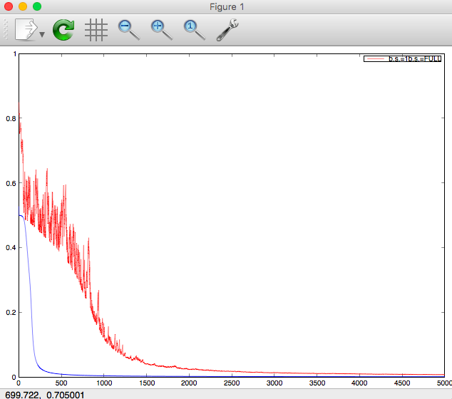

# Comparison of Different Batch Sizes in Neural Network Learning Models

In this example, I train a simple neural network on a dataset to overfit an XOR Logic Gate.

Clone this repository and run `ez_nn.m` in Octave/Matlab.

Results:
(red: batch size = 1; blue: batch size = # of training examples)

